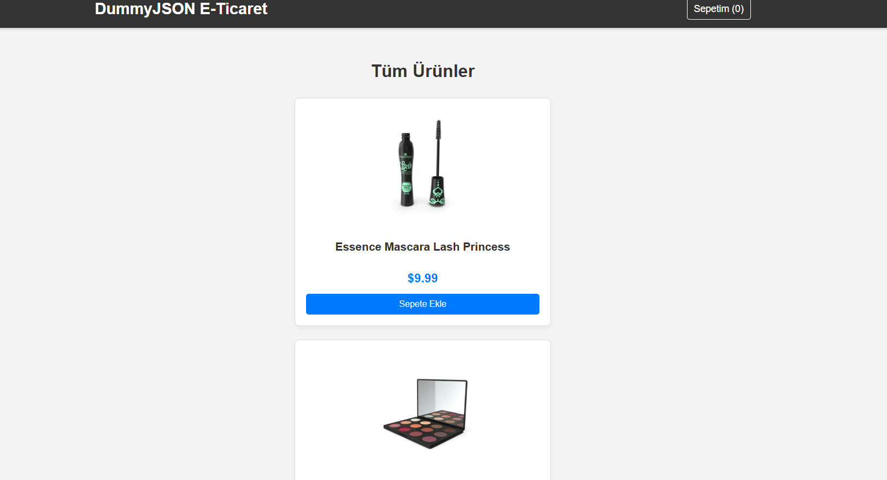
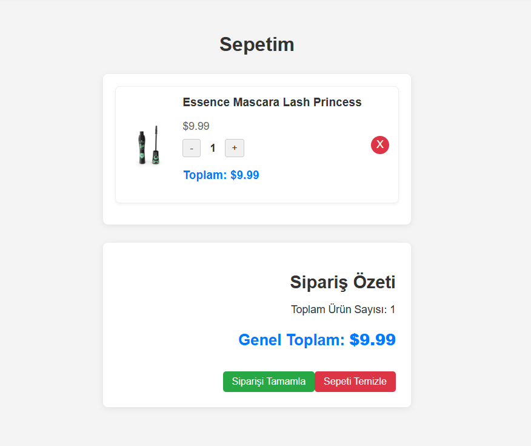

# productSite

Bu proje, Vue 3, Vuex, Axios, Mixins ve Options API kullanılarak geliştirilmiş bir alışveriş sitesi uygulamasıdır.  
Projenin temel amacı, modern JavaScript teknolojilerini kullanarak hem hızlı hem de kullanıcı dostu bir e-ticaret deneyimi sunmaktır.  

Uygulama içerisinde ürünler, **dummyjson** API’sinden Axios kütüphanesi aracılığıyla çekilmektedir. Bu sayede gerçek bir veri kaynağı ile çalışma mantığı simüle edilerek, dinamik olarak güncellenen bir ürün listesi oluşturulmuştur.  

**Vuex** kullanımı sayesinde proje içerisinde state yönetimi çok daha düzenli ve anlaşılır bir yapıya kavuşturulmuştur. Böylece farklı bileşenler arasında veri akışı kolaylıkla sağlanmış ve kod karmaşasının önüne geçilmiştir.  

Ayrıca, **Mixins** yapısı kullanılarak tekrar eden fonksiyonlar ve mantıklar tek bir yerde toplanmış, kodun bakım ve genişletilebilirlik açısından daha sürdürülebilir olması sağlanmıştır.  

**Projenin çalıştırılması** oldukça basittir:  
1. Gerekli bağımlılıkları yüklemek için:  npm install

2. Projeyi başlatmak için:  npm run serve

Bu adımların ardından proje yerel sunucuda çalışmaya başlayacak ve tarayıcınız üzerinden alışveriş sitesini görüntüleyebileceksiniz.  

